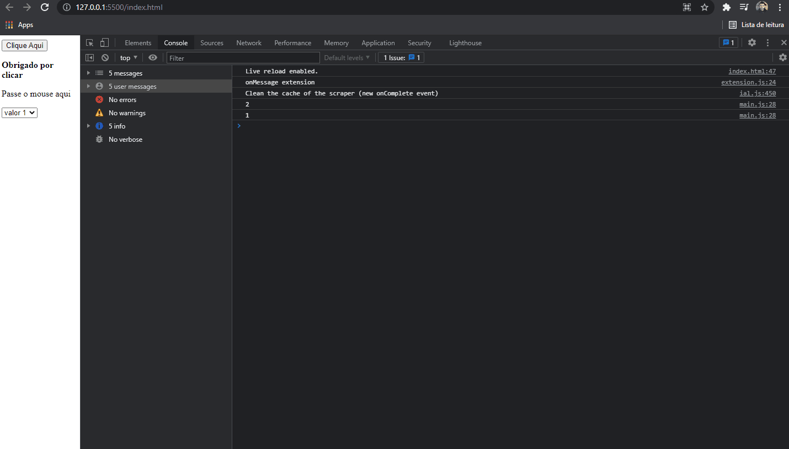

<h1 align="center">
  
   
</h1>

<h3 align="justify">
Academic demonstration of basic JavaScript functions with Html. Credits for Digital Innovation One's introductory JavaScript module.
</h3>

 

## 📷 Demonstration

  

 

## 🚀 Technologies

This project was developed with the following technologies:

- JavaScript
- HTML5

 

## ⚙ Settings
- onclick
- onmouseover
- onmouseout
- onchange
- document.getElementById("").innerHTML = "<b>""</b>
- window.location.href
- alert("")
- prompt
- setReplace
- function
- alert(d.getMonth()+1)
- alert(d.getMinutes())
- alert(d.getDay())
- count++
- lista.pop()
- lista.push("")
 

---

Made with 💜 by Rafael Maciel
